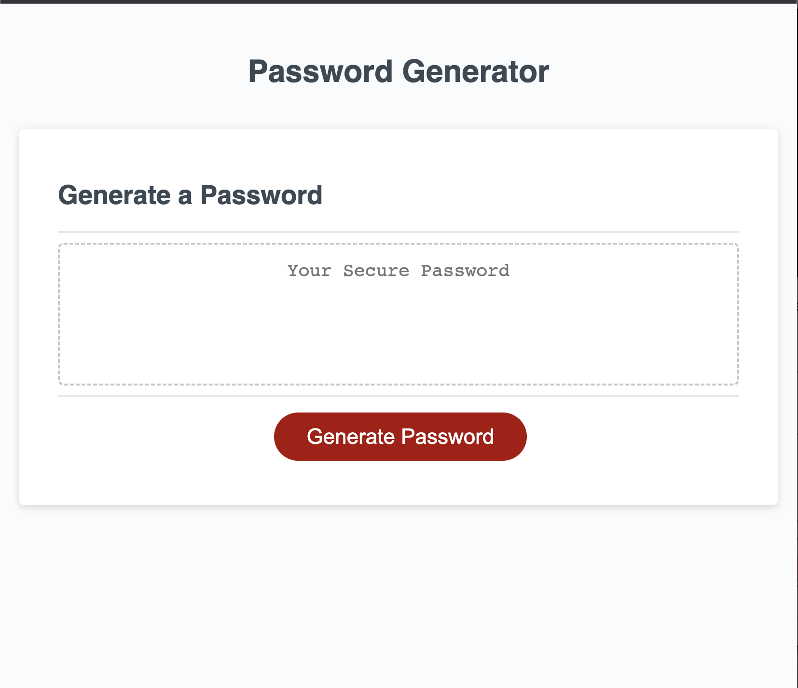

# Password Generator

## Description

This application is a Password Generator that uses characters types based on user input.  I created this project as an assignment from my Bootcamp and to better understand the functions and objects manipulation and use in JavaScript. This Password generator build strong passwords considering user inputs and randomizing them.  

Deployed application: https://anawada.github.io/Password-generator/

## Usage 

Press the button, answer the questions and you will have your password generated!!

## License

None

